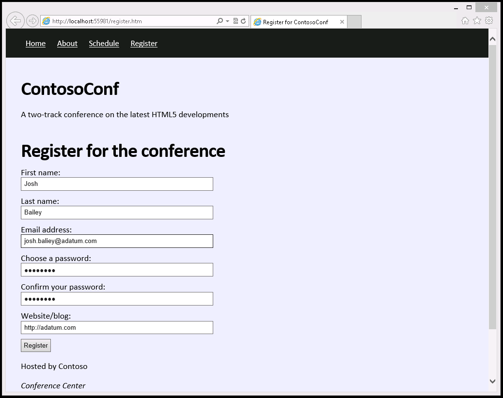
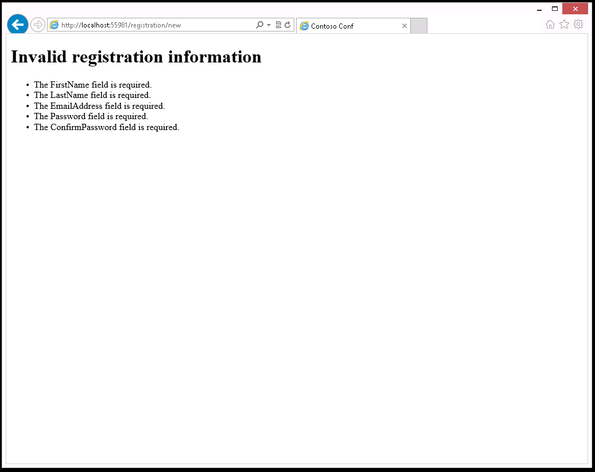
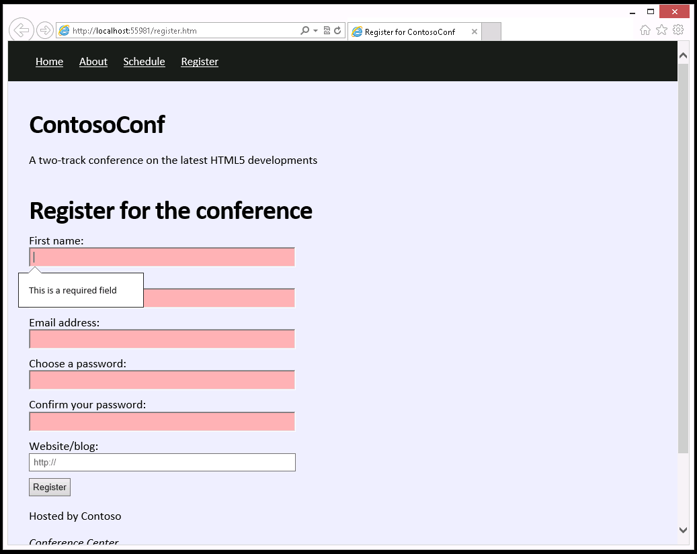

## Module 4: Creating Forms to Collect and Validate User Input

## Lab: Creating a Form and Validating User Input

#### Scenario

Delegates who want to attend ContosoConf will be required to register and provide their details. You have been asked to add a page to the ContosoConf website that implements an attendee registration form.

The server-side code already exists to process the attendee data. However, the registration page performs very minimal validation that is not user friendly. You have decided to add client-side validation to the form to improve the accuracy of the registration data entered by attendees and to provide a better user experience.

#### Objectives

After completing this lab, you will be able to:
- Create a form by using HTML5 input elements and validate form data by using HTML5 attributes.
- Implement extended data validation by using JavaScript.

#### Lab Setup

Estimated Time: **60 minutes**

### Exercise 1: Creating a Form and Validating User Input by Using HTML5 Attributes

#### Scenario

In this exercise, you will create an HTML form that collects conference attendee registration information.

You will select the correct input types for each piece of data collected by the form. Then you will enhance the input with additional attributes to improve the user experience and to add validation. For example, the first input item should automatically receive the focus when a page loads. Also, most of the input items are mandatory, the password must be sufficiently complex to improve security, and the form must prevent incomplete data or data that is not valid from being submitted. Finally, you will run the application, view the Register page, and verify that form validation performs correctly.

#### Task 1: Modify the Register page.

1.	Start the **MSL-TMG1** virtual machine if it is not already running.
2.	Start the **20480C-SEA-DEV11** virtual machine if it is not already running, and log on as **Student** with the password **Pa$$w0rd**.
3.	Start Visual Studio and open the **ContosoConf.sln** solution in the **E:\Mod04\Labfiles\Starter\Exercise 1** folder.
4.	Open the **register.htm** file. 
5.	Find the **&lt;form&gt;** element and read the TODO comment that describes the form input requirements together with the HTML snippet to use as a template:
    ```html
        <form method="post" action="/registration/new" id="registration-form">
            <!--
                TODO: Add form inputs

                FirstName - required string
                LastName - required string
                EmailAddress - required email address
                Password - required password string, at least 5 letters and numbers
                ConfirmPassword
                WebsiteUrl - optional url string
            -->

            <!-- Use the following template for the inputs -->
            <div class="field">
                <label for="{input-id}">label:</label>
                <input type="{type}" id="{input-id}" name="{input-name}" />
            </div>

            <div>
                <button type="submit">Register</button>
            </div>
        </form>
    ```
6.	Notice that **register.htm** has a reference to the style sheet **/styles/pages/register.css** in the **&lt;head&gt;** element **/scripts/pages/register.js** just before the **&lt;/body&gt;** tag:
    ```html
        <link href="/styles/pages/register.css" rel="stylesheet" type="text/css" />
    ```
This CSS file contains the styles for the registration page.
7.	Also notice that the **register.htm** file contains a reference to the **/scripts/pages/register.js** JavaScript file that contains the code used by the registration page:
  ```html
      <script src="/scripts/pages/register.js" type="text/javascript"></script>
  ```

#### Task 2: Add form inputs to the Register page.

1.	Add the input elements specified by the TODO comment to the registration form:
- Do not include any validation yet.
- Use the most appropriate HTML5 input types. 
- Use the &lt;div class="field"&gt; template when creating the form inputs; provide a label for each input, and remove this template when you have added all of the inputs.
2.	Run the application, view the **register.htm** page, and test the form with some valid data. The following image shows some suggested valid data values that you can use (use the text **Passw0rd** for the password).



3.	After you have entered a complete set of valid data, click **Register**. Verify that the **Thanks for registering page** appears.
4.	Return to the **Register** page. Notice that you have to explicitly click to put the cursor in the First name field to start registering another attendee. 

Also, notice that you can leave fields blank, or enter mismatching passwords. 
5.	Click **Register** again. 



It would be more efficient to trap these issues before the data is transmitted to the server.
6.	Close Internet Explorer.

#### Task 3: Make the form more user friendly.

1.	In the **register.htm** file, modify the **FirstName** input so that it automatically gets the focus when the browser loads the register page.
- Use the **autofocus** attribute.
2.	Modify the **Website** input to display the placeholder text **http://** when the page is displayed.
- Use the **placeholder** attribute.
3.	Run the application, view the **register.htm** page, verify that the **First name** box has focus and that the **Website** box contains the placeholder text.
4.	Close Internet Explorer.

#### Task 4: Check for missing mandatory data.

1.	In the **register.htm** file, add **required** attributes to the mandatory form inputs (**FirstName**, **LastName**, **EmailAddress**, **Password**, **ConfirmPassword**).
- Use the **required** attribute.

>**Note:** The password validation performed by the registration server requires that password contain letters and numbers only. Punctuation and other characters are not allowed.

2.	Run the application, view the **register.htm** page, and click **Register** without entering any data.
3.	Try entering different combinations of fields, and verify that the form cannot be submitted if any mandatory field is empty.


4.	Enter the complete details for an attendee and then click **Register**. Verify that the form still enables the user to submit valid data.

#### Task 5: Add password complexity validation.

1.	In the **register.htm** file, modify the **Password** input to ensure that the entered value is at least five characters long, and consists of only letters and numbers.
- Use pattern attribute with the following regular expression:
    ```html
        [a-zA-Z0-9]{5,}
    ```
- If the **Password** input doesn’t match the regular expression, display the following message by using the **title** attribute: 
    ```html
        At least 5 letters and numbers
    ```
2.	Run the application, view the **register.htm** page, register as an attendee, and verify that **Password** input displays the error message for password entries that are not valid.
- Try a short password, such as **abc** 
3.	Verify that valid passwords containing at least five letters and numbers are still accepted.
- Try a longer password such as **password** (this should work)
- Also, try a password with at least one numeric character, such as **Passw0rd** (this should also work)

>**Results:** After completing this exercise, you will have modified the attendee registration page to validate the data entered by attendees.

### Exercise 2: Validating User Input by Using JavaScript.

#### Scenario

The conference registration form requires that the Password and Confirm Password inputs match. You cannot implement this type of validation by using HTML5 attributes. In this exercise, you will extend the registration form validation by using JavaScript. In addition, you will write code to style any input that is not valid to attract the user’s attention.

You will implement a function to compare the two passwords and display an error message when the passwords do not match. Then you will add input event listeners for the password inputs, which call the password comparison function. You will test this feature to ensure that a user cannot submit a form with passwords that do not match.

Next, you will add a CSS style to highlight input elements that are not valid (some browsers such as Internet Explorer already highlight them with a red border, but other browsers might not implement this feature by default). You will run the application, view the Register page, and verify that elements that are not valid are highlighted.

#### Task 1: Write code to get the contents of the password input elements.

1.	In Visual Studio, open the **ContosoConf.sln** solution in the **E:\Mod04\Labfiles\Starter\Exercise 2** folder. This project contains a working version of the application as it should appear at the end of exercise 1, together with additional comments and code fragments that are used by this exercise.
2.	In the **ContosoConf** project, open the **scripts\pages\register.js** file and find the following comment: 
    ```javascript
        // TODO: Task 1 - Get the password <input> elements from the DOM by ID
    ```
3.	Create variables named **passwordInput** and **confirmPasswordInput** that contain references to the password fields on the form. 
- Use the **getElementById** function.
- The **id** attributes of the password **&lt;input&gt;** elements are **password** and **confirm-password**

#### Task 2: Write code to compare the password and confirm-password inputs.

1.	The register.js file contains a function called **checkPasswords** that will examine whether the password and confirm-password inputs contain the same text. This function is currently empty (apart from some comments). 

In the **scripts\pages\register.js** file find the following comment: 
   ```javascript
       // TODO: Task 2 - Compare passwordInput value to confirmPasswordInput value
   ```

2.	Add a statement that tests whether the two password inputs have the same value and store the Boolean result in a variable named **passwordsMatch**.
- Use the **value** property of the **passwordInput** and **confirmPasswordInput** variables to read the data that the user has entered into the password fields on the form.
- Compare the value by using the === operator.

#### Task 3: Write code to display a custom error message if the passwords differ.

1.	In the **comparePasswords** function, find the comment that starts with the following text:
    ```javascript
        // TODO: Task 3
    ```
2.	Add code that uses the **setCustomValidity** method of the **confirmPasswordInput** variable to display an error message when the **passwordsMatch** variable indicates that the passwords do not match.

If the passwords do match, clear the error message.

>**Note:** Setting a non-empty custom validity message will prevent the form from being submitted.

#### Task 4: Add input event listeners to the inputs to call the checkPasswords method.

1.	The password input elements raise an event named **input** when text is entered. 

In the **register.js** file, find the comment that starts with the following text:
   ```javascript
       // TODO: Task 4
   ```
2.	In the **addPasswordInputEventListeners** function, add event listeners for this event to call the **checkPasswords** function.
- Use the **addEventListener** function.
3.	Run the application, view the **register.htm** page, enter valid data for the **First name**, **Last name**, and **Email address** fields, and verify that an error message is displayed when the data in the **Confirm Password** box does not match the data in the **Password** box.
4.	Verify that the message does not appear if the passwords are the same.
5.	Close Internet Explorer.

#### Task 5: Style elements that are not valid.

1.	In the **ContosoConf** project, open the **styles\pages\register.css** file.
2.	At end of the file, find the comment that starts with the following text:
    ```css
        /* TODO: Task 5
    ```
3.	Add a CSS rule that changes the background color of input elements that are not valid to **#f9b2b2**.
- The form has the class **register**, so only apply this styling to inputs that occur in this form (use the **.register** selector)
- Additionally, ensure that the CSS rule only applies when the **&lt;form&gt;** element has the **submission-attempted** class (concatenate **form.submission-attempted** to the selector)

>**note:** The extra CSS class is added by the **formSubmissionAttempted** function, which is called when the **Register** button is clicked, as shown in the following code from the register.js file:
>
>    ```javascript
>        var formSubmissionAttempted = function() {
>                form.classList.add("submission-attempted");
>        };
>
>        var addSubmitClickEventListener = function() {
>                submitButton.addEventListener("click", formSubmissionAttempted, false);
>        };
>    ```
>Initially, the required form inputs are empty and therefore not valid. However, the application should allow the user to complete the form before showing error messages.

- Finally, the styling should only be applied for the input is invalid, so concatenate the pseudo-class **input:invalid** to the end of the selector.
- Note that Internet Explorer automatically adds a red outline to inputs that are not valid. Remove this default styling by setting the **outline** CSS property to **none**.
4.	Run the application, view the **register.htm** page, click the **Register** button without entering any registration details, and verify that inputs that are not valid are highlighted with colored backgrounds.



5.	Close Internet Explorer. 

>**Result:** After completing this exercise, you will have modified the registration page to validate password inputs.

©2017 Microsoft Corporation. All rights reserved.

The text in this document is available under the  [Creative Commons Attribution 3.0 License](https://creativecommons.org/licenses/by/3.0/legalcode), additional terms may apply. All other content contained in this document (including, without limitation, trademarks, logos, images, etc.) are  **not**  included within the Creative Commons license grant. This document does not provide you with any legal rights to any intellectual property in any Microsoft product. You may copy and use this document for your internal, reference purposes.

This document is provided &quot;as-is.&quot; Information and views expressed in this document, including URL and other Internet Web site references, may change without notice. You bear the risk of using it. Some examples are for illustration only and are fictitious. No real association is intended or inferred. Microsoft makes no warranties, express or implied, with respect to the information provided here.
