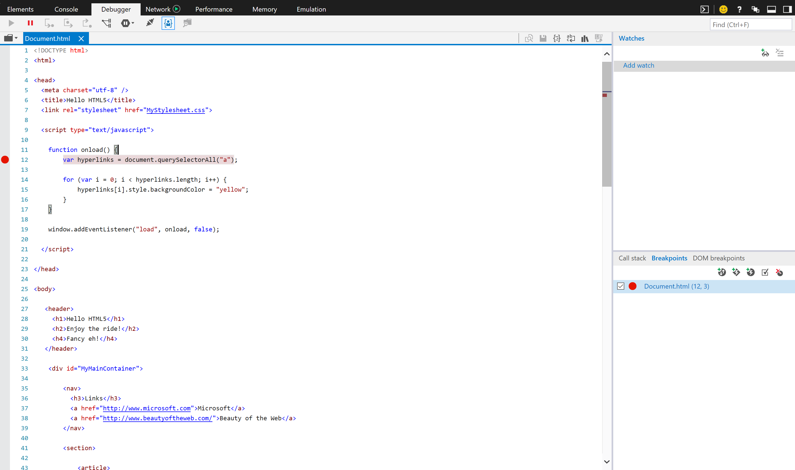

# Module 8: Creating Interactive Pages by Using HTML5 APIs

# Lesson 4: Debugging and Profiling a Web Application

### Demonstration: Using the F12 Developer Tools to Debug JavaScript Code

#### Preparation Steps 

1. Ensure that you have cloned the 20480C directory from GitHub. It contains the code segments for this course's labs and demos. https://github.com/MicrosoftLearning/20480-Programming-in-HTML5-with-JavaScript-and-CSS3/tree/get_started/Allfiles.

#### Demonstration Steps

#### Set a Breakpoint in JavaScript code

1.	On the Windows 10 **Start** screen, click the **Desktop** tile.
2.	On the Windows taskbar, click **Microsoft Edge**.
3.	In Microsoft Edge, browse to the file **Allfiles\Mod08\Democode\Document.html**.
4.	If the message **Microsoft Edge restricted this webpage from running scripts or ActiveX controls** appears, click **Allow blocked content**.
5.	Press F12 to display the Developer Tools window.
6.	If the F12 Developer Tools window appears as a pane in Microsoft Edge, in the F12 Developer Tools pane, click **Unpin**.

>**Note:** This action causes the F12 Developer Tools to appear in a standalone window.

7.	In the F12 Developer Tools window, click **Script**.
8.	Click in the margin next to line 12, in order to create a breakpoint on the first statement inside the **onload()** function. 

#### Step Through JavaScript Code and Examine Variables

1.	On the F12 Developer Tools toolbar, click **Start debugging**. 
2.	In the F12 Developer Tools window, verify that the debugger pauses execution at the breakpoint. 
3.	In the right pane, click the **Locals** tab.
4.	On the F12 Developer Tools toolbar, click the **Step over** button several times to step through the code. In the **Locals** tab, verify that the value of the **i** variable changes as execution progresses.
5.	Close the F12 Developer Tools window.
6.	Close Microsoft Edge.

### Demonstration: Using the F12 Developer Tools to Profile a Web Application

#### Preparation Steps 

1. Ensure that you have cloned the 20480C directory from GitHub. It contains the code segments for this course's labs and demos. https://github.com/MicrosoftLearning/20480-Programming-in-HTML5-with-JavaScript-and-CSS3/tree/get_started/Allfiles.

#### Demonstration Steps

#### Examine the Network Traffic for a Web Application

1.	On the Windows 10 **Start** screen, click the **Desktop** tile.
2.	On the Windows taskbar, click **Microsoft Edge**.
3.	In Microsoft Edge, browse to the website **http://www.beautyoftheweb.com/**.
4.	Press F12 to display F12 Developer Tools window.
5.	In the F12 Developer Tools window, click **Network**.
6.	On the F12 Developer Tools toolbar, click **Start capturing**.
7.	In Microsoft Edge, click the **touchgallery** icon in the navigation bar.
8.	Return to the F12 Developer Tools window.

9.	Click the first line of the network capture, and then on the toolbar click **Go to detailed view**.
10.	Click each of the following tabs and show the data that they contain:
- **Request headers**.
- **Request body**.
- **Response headers**.
- **Response body**.
- **Cookies**.
- **Initiator**.
- **Timings**.
11.	On the F12 Developer Tools toolbar, click **Stop capturing**.

#### Capture Profile Data for a Web Application

1.	In the F12 Developer Tools window, click **Profiler**.
2.	On the F12 Developer Tools toolbar, click **Start profiling**.
3.	In Microsoft Edge, click the **videos** icon in the navigation bar.
4.	Return to the F12 Developer Tools window.
5.	On the F12 Developer Tools toolbar, click **Stop profiling**.

6.	On the F12 Developer Tools toolbar, in the **Current view** list, click **Call tree**.
7.	In the **Search Profiler** box, type **onWindowEvent** and then press **ENTER**.
In the captured data, examine the work performed by the **onWindowEvent** event handler.
8.	Double-click **onWindowEvent** to display the code for this event handler in the **Script** window
9.	Press **Ctrl+Alt+O** to display the tools menu, and then select **Format JavaScript** to display the code in an easier to read format.
10.	Close the F12 Developer Tools window.
11.	Close Microsoft Edge.

### Demonstration: Creating Interactive Pages with HTML5 APIs

#### Preparation Steps 

1. Ensure that you have cloned the 20480C directory from GitHub. It contains the code segments for this course's labs and demos. https://github.com/MicrosoftLearning/20480-Programming-in-HTML5-with-JavaScript-and-CSS3/tree/get_started/Allfiles.

©2018 Microsoft Corporation. All rights reserved.

The text in this document is available under the  [Creative Commons Attribution 3.0 License](https://creativecommons.org/licenses/by/3.0/legalcode), additional terms may apply. All other content contained in this document (including, without limitation, trademarks, logos, images, etc.) are  **not**  included within the Creative Commons license grant. This document does not provide you with any legal rights to any intellectual property in any Microsoft product. You may copy and use this document for your internal, reference purposes.

This document is provided &quot;as-is.&quot; Information and views expressed in this document, including URL and other Internet Web site references, may change without notice. You bear the risk of using it. Some examples are for illustration only and are fictitious. No real association is intended or inferred. Microsoft makes no warranties, express or implied, with respect to the information provided here.
