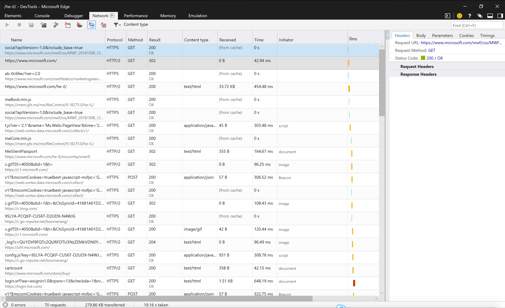
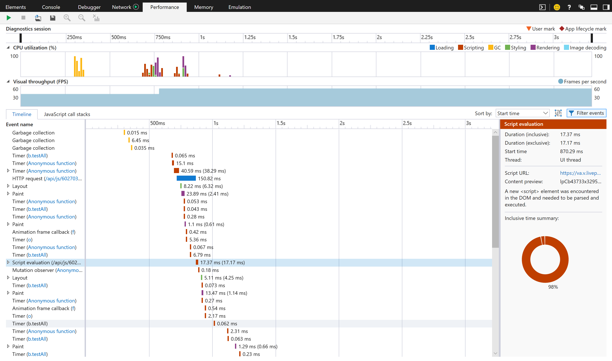

# Module 8: Creating Interactive Pages by Using HTML5 APIs

# Lesson 4: Debugging and Profiling a Web Application

### Demonstration: Using the F12 Developer Tools to Debug JavaScript Code

#### Preparation Steps 

Ensure that you have cloned the 20480C directory from GitHub (**https://github.com/MicrosoftLearning/20480-Programming-in-HTML5-with-JavaScript-and-CSS3/tree/master/Allfiles**). It contains the code segments for the labs and demos in this course.

#### Demonstration Steps

#### Set a Breakpoint in JavaScript Code

1.	On the Start screen, click the **Desktop** tile.
2.	On the Windows taskbar, click **Microsoft Edge**.
3.	In Microsoft Edge, browse to the file **[Repository Root]\Allfiles\Mod08\Democode\Document.html**.
4.	If the **Microsoft Edge restricted this webpage from running scripts or ActiveX controls** message appears, click **Allow blocked content**.
5.	To display the **Developer Tools** window, press F12.
6.	If the **F12 Developer Tools** window appears as a pane in Microsoft Edge, in the **F12 Developer Tools** pane, click **Unpin**.

>**Note:** This action causes the **F12 Developer Tools** window to appear as a standalone window.

7.	In the **F12 Developer Tools** window, click **Script**.
8.	To create a breakpoint on the first statement inside the **onload()** function, click in the margin next to line 12. 


#### Step Through JavaScript Code and Examine Variables

1.	On the **F12 Developer Tools** toolbar, click **Start debugging**. 
2.	In the **F12 Developer Tools** window, verify that the debugger pauses execution at the breakpoint. 
3.	In the right pane, click the **Locals** tab.
4.	On the **F12 Developer Tools** toolbar, click the **Step over** button several times to step through the code. In the **Locals** tab, verify that the value of the **i** variable changes as execution progresses.
5.	Close the **F12 Developer Tools** window.
6.	Close Microsoft Edge.

### Demonstration: Using the F12 Developer Tools to Profile a Web Application

#### Preparation Steps 

Ensure that you have cloned the 20480C directory from GitHub (**https://github.com/MicrosoftLearning/20480-Programming-in-HTML5-with-JavaScript-and-CSS3/tree/master/Allfiles**). It contains the code segments for the labs and demos in this course.

#### Demonstration Steps

#### Examine the Network Traffic for a Web Application

1.	On the Start screen, click the **Desktop** tile.
2.	On the Windows taskbar, click **Microsoft Edge**.
3.	In Microsoft Edge, browse to the website **http://www.microsoft.com/**.
4.	To display the **F12 Developer Tools** window, press F12.
5.	In the **F12 Developer Tools** window, click **Network**.
6.	On the **F12 Developer Tools** toolbar, click **Start Profiling Session**.



7.	Click the first line of the network capture.
8.	On the right side, click each of the following tabs and show the data that they contain:
- **Request headers**
- **Request body**
- **Response headers**
- **Response body**
- **Cookies**
- **Initiator**
- **Timings**
9.	On the **F12 Developer Tools** toolbar, click **Stop Profiling Session**.

#### Capture Profile Data for a Web Application

1.	In the **F12 Developer Tools** window, click **Performance**.
2.	On the **F12 Developer Tools** toolbar, click **Start Profiling Session**.
3.	In Microsoft Edge, click the **Cart** icon in the navigation bar.
4.	Return to the **F12 Developer Tools** window.
5.	On the **F12 Developer Tools** toolbar, click **Stop profiling Session**.



6.	On the **F12 Developer Tools** toolbar, in the **Performance** list, click **Timeline**.
7.	In the **Timeline**, you can see the order and the time the event append.
8.	Click **JavaScript call stacks**.
9.	In the **JavaScript call stacks**, you can see the method tree that append.
10.	Close the **F12 Developer Tools** window.
11.	Close Microsoft Edge.


### Demonstration: Creating Interactive Pages with HTML5 APIs

#### Preparation Steps 

Ensure that you have cloned the 20480C directory from GitHub (**https://github.com/MicrosoftLearning/20480-Programming-in-HTML5-with-JavaScript-and-CSS3/tree/master/Allfiles**). It contains the code segments for the labs and demos in this course. 

#### Demonstration Steps

1.	Read the lab scenario to the students and point out that they should read each scenario before attempting the lab for a module.
2.	Point out to the students that the exercise scenario for each exercise contains a description of what they will accomplish in the exercise, and is also essential reading.
3.	Start Microsoft Visual Studio, and then from the **Allfiles\Mod08\Labfiles\Solution\Exercise 3** folder, open the **ContosoConf.sln** solution.
4.	In **Solution Explorer**, expand the **ContosoConf** project, and then double-click **speaker-badge.htm**.
5.	In the **Code Editor** window, scroll through the code and find the following **&lt;section&gt;** element:
    ```html
        <section class="page-section badge">
            <div class="container">
                <h1>Create your speaker badge for ContosoConf</h1>
                <p>Drag and drop your profile picture here...</p>
                
            </div>
        </section>
    ```
6.	Explain that the students will add a drag and drop functionality to the **&lt;img&gt;** element in this section to enable a user to drag an image file and drop it on the web page, where it will appear in this element.
7.	In **Solution Explorer**, expand the **scripts** folder, expand the **pages** folder, and then double-click **speaker-badge.js**. Students will complete the code for the **SpeakerBadgePage** object in this script to handle **dragover** and **dragdrop** events. When the **dragdrop** event occurs, the event handler will read the file dropped on the image element and display the contents on the web page.
8.	Display the **speaker-badge.htm** file in the **Code Editor** window, and then on the **Debug** menu, click **Start Without Debugging**.

>**Note**: It is necessary to display this file in the **Code Editor** window so that Visual Studio navigates directly to this page when it starts the application; the Speaker Badge page is not listed in the navigation bar.

>**Note**: If the message **Intranet settings are turned off by default** appears, click **Don’t show this message again**.

9.	On the Windows taskbar, click **File Explorer**, and then browse to **[Repository Root]\Allfiles\Mod08\Labfiles\Resources**.
10.	Drag-and-drop **mark-hanson.jpg** from File Explorer, onto the empty rectangle in Internet Explorer, and verify that the image appears on the page.
11.	Close Microsoft Edge.
12.	In **Solution Explorer**, double-click **index.htm**.
13.	Find the following section near the bottom of the file. This section contains the HTML markup for the video controls that download and play a video presentation of a session from a previous conference:
    ```html
        <section class="video">
            <h2>Video from last year</h2>
            <video src="http://ak.channel9.msdn.com/ch9/265b/9a76fccd-941e-4285-ad00-9ea200aa265b/MIX09KEY01_high_ch9.mp4"></video>
            <div class="video-controls" style="display: none">
                <button class="video-play">Play</button>
                <button class="video-pause">Pause</button>
                <span class="video-time"></span>
            </div>
        </section>
    ```
14.	In **Solution Explorer**, in the **scripts\pages** folder, double-click **video.js**. Explain that this file contains the code that students will write to play and pause the video and display the elapsed time while the video runs.
15.	On the **Debug** menu, click **Start Without Debugging**.
16.	Scroll to the bottom of the **Home** page, and then click **Play**. Notice that the video starts running, a **Pause** button appears, and the elapsed time is also displayed.
17.	To suspend the video, click **Pause**.
18.	Close Microsoft Edge.
19.	In **Solution Explorer**, double-click **location.htm**.
20.	Find the following section near the bottom of the file. This **&lt;h2&gt;** element with the **id** of distance will be used to display the distance of the user from the conference location:
    ```html
        <section class="travel">
            <h1>Travelling to ContosoConf</h1>
            <h2 id="distance"></h2>
            <h2>Address</h2>
            <address>
                ...
            </address>
            <h2>Hotels</h2>
            <p>...</p>
        </section>
    ```
21.	In **Solution Explorer**, in the **scripts\pages** folder, double-click **location.js**. Explain that this file contains the code that the students will write to find and display the distance of the user from the conference location by using the Geolocation API.
22.	On the **Debug** menu, click **Start Without Debugging**.
23.	In the navigation bar, click **Location**.
24.	If the **localhost wants to track your physical location** message box appears, click **Allow once**.
25.	If the **Enable Location Services** dialog box appears, click **Yes**.
26.	Point out that the distance to the conference venue appears above the address on the **Location** page.
27.	Close Microsoft Edge.
28. Close all open windows.

©2018 Microsoft Corporation. All rights reserved.

The text in this document is available under the  [Creative Commons Attribution 3.0 License](https://creativecommons.org/licenses/by/3.0/legalcode), additional terms may apply. All other content contained in this document (including, without limitation, trademarks, logos, images, etc.) are  **not**  included within the Creative Commons license grant. This document does not provide you with any legal rights to any intellectual property in any Microsoft product. You may copy and use this document for your internal, reference purposes.

This document is provided &quot;as-is.&quot; Information and views expressed in this document, including URL and other Internet Web site references, may change without notice. You bear the risk of using it. Some examples are for illustration only and are fictitious. No real association is intended or inferred. Microsoft makes no warranties, express or implied, with respect to the information provided here.
