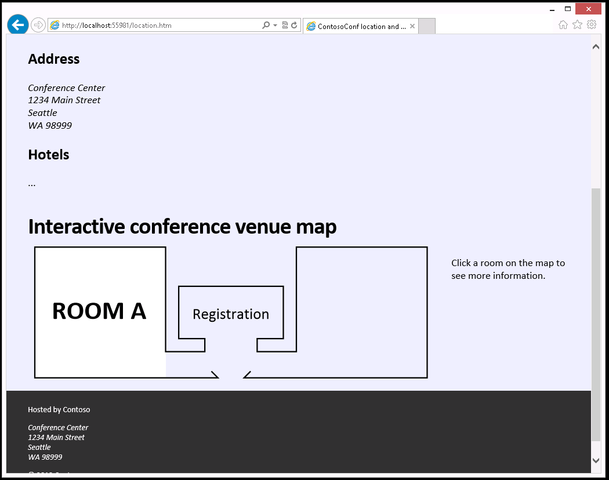
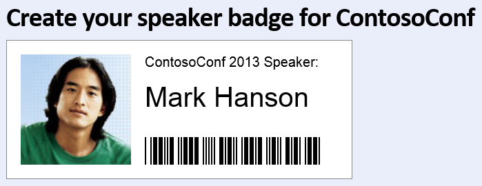

# Module 11: Creating Advanced Graphics.

# Lab: Creating Advanced Graphics.

### Lab Setup

### Preparation Steps

1.	Ensure that you have cloned the 20480C directory from GitHub. It contains the code segments for this course's labs and demos. https://github.com/MicrosoftLearning/20480-Programming-in-HTML5-with-JavaScript-and-CSS3/tree/master/Allfiles.

### Exercise 1: Creating an Interactive Venue Map by Using SVG.

#### Task 1: Review the incomplete HTML markup for the venue map.

1.	Open **Visual Studio 2017**.
2.	In Visual Studio, on the **File** menu, point to **Open**, and then click **Project/Solution**.
3.	In the **Open Project** dialog box, browse to **Allfiles\Mod11\Labfiles\Starter\Exercise 1**, click **ContosoConf.sln**, and then click **Open**.
4.	In Solution Explorer, expand the **ContosoConf** project node, and then double-click **location.htm**.
5.	Verify that the page contains the following HTML markup:
    ```html
        <svg viewBox="-1 -1 302 102" width="100%" height="230">
            <!-- Room A -->
            <g id="room-a" class="room">
                <rect fill="#fff" x="0" y="0" width="100" height="100"/>
                <text x="13" y="55" font-weight="bold" font-size="20">ROOM A</text>
            </g>
            <!-- Room B -->

            <!-- The outline of the building -->
            <polyline fill="none" stroke="#000" points="135,95 140,100 0,100 0,0 100,0 100, 80 130,80 130,70 110,70 110,30 190,30 190,70 170,70 170,80 200,80 200,0 300,0 300,100 160,100 165,95"/>
            <text x="150" y="55" font-size="12" style="text-anchor:middle">Registration</text>
        </svg>
    ```
6.	Verify that the HTML contains the following markup:
    ```html
        <script src="/scripts/pages/location-venue.js" type="text/javascript"></script>
    ```
7.	On the **Debug** menu, click **Start Without Debugging**. 
8.	Click **Location**.
9.	If the message **localhost wants to track your location** appears, click **Allow once**.
10.	In the **Enable Location Services** dialog box, click **Yes**.
11.	If the message **Intranet settings are turned off by default** appears, click **Don’t show this message again**.
12.	Scroll down and view the venue map.



13.	Close Microsoft Edge.

#### Task 2: Complete the SVG venue map.

1.	In Visual Studio, in **location.htm**, find the following comment:
    ```html
        <!-- Room B -->
    ```
2.	After the comment, add the following markup:
    ```html
        <g id="room-b" class="room">
            <rect fill="#fff" x="200" y="0" width="100" height="100"/>
            <text x="213" y="55" font-weight="bold" font-size="20">ROOM B</text>
        </g>
    ```

#### Task 3: Add interactivity to the venue map.

1.	In Solution Explorer, double-click **location.htm**.
2.	Find the following HTML markup:
    ```html
        <div id="room-a-info" style="display: none">
          <h2>Room A</h2>
          <p>Capacity: 250</p>
          <p>Popular sessions in here:</p>
          <ul>
            <li>Diving in at the deep end with Canvas</li>
            <li>Real-world Applications of HTML5 APIs</li>
            <li>Transforms and Animations</li>
          </ul>
        </div>
        <div id="room-b-info" style="display: none">
          <h2>Room B</h2>
          <p>Capacity: 230</p>
          <p>Popular sessions in here:</p>
          <ul>
            <li>Building Responsive UIs</li>
            <li>Getting to Grips with JavaScript</li>
            <li>A Fresh Look at Layouts</li>
          </ul>
        </div>
    ```
3.	In Solution Explorer, expand the **styles** folder, expand the **pages** folder, and then double-click **location.css**. 
4.	At the end of the file, add the following CSS:
    ```css
        .room:hover rect {
            fill: #b1f8b0;
        }
    ```
5.	In Solution Explorer, expand the **scripts** folder, expand the **pages** folder, and then double-click **location-venue.js**.
6.	Find the following comment:
    ```javascript
        // TODO: Get the room elements in the svg element.
    ```
7.	After this comment, add the following JavaScript code:
    ```javascript
        const rooms = document.querySelectorAll(".room");
    ```
8.	Find the comment that starts with the following text:
    ```javascript
        // TODO: Add a click event listener for each room element.
    ```
9.	After the second line of this comment, add the following JavaScript code:
    ```javascript
        for (let i = 0; i < rooms.length; i++) {
            const room = rooms[i];
            room.addEventListener("click", function () {
                showRoomInfo(this.id);
            });
        }
    ```

#### Task 4: Test the application.

1.	In Solution Explorer, double-click **location.htm**.
2.	On the **Debug** menu, click **Start Without Debugging**.
3.	In Microsoft Edge, if the message **localhost wants to track your physical location** appears, click **Allow once**.
4.	Scroll down to the venue map and hover the mouse over **Room A**.
5.	Verify that the venue map looks similar to the following image:


6.	Click **Room B**, verify that the room information is displayed, and that it is similar to the following image:


7.	Close Microsoft Edge.

>**Results:** After completing this exercise, you will have a venue map that displays extra information when clicked.

### Exercise 2: Creating a Speaker Badge by Using the Canvas API.

#### Task 1: Create the canvas element.

1.	In Visual Studio, on the **File** menu, point to **Open**, and then click **Project/Solution**.
2.	In the **Open Project** dialog box, browse to **Allfiles\Mod11\Labfiles\Starter\Exercise 2** click **ContosoConf.sln**, and then click **Open**.
3.	In Solution Explorer, expand the **ContosoConf** project, and then double-click **speaker-badge.htm**.
4.	Find the following comment:
    ```html
        <!-- TODO: Add canvas here -->
    ```
5.	After this comment, add the following HTML markup:
    ```html
        <canvas
            width="500" 
            height="200" 
            style="border: 1px solid "#888"
            data-speaker-id="234724"
            data-speaker-name="Mark Hanson">
        </canvas>
    ```

#### Task 2: Draw the details for the badge.

1.	In Solution Explorer, expand the **scripts** folder, expand the **pages** folder, and then double-click **speaker-badge.js**.
2.	Verify that the file contains the following JavaScript code:
    ```javascript
        this.canvas = element.querySelector("canvas");
    ```
3.	Find the following comment: 
    ```javascript
        // TODO: Get the canvas's (this.canvas) context and assign to this.context
    ```
4.	After this comment, add the following JavaScript code:
    ```javascript
        this.context = this.canvas.getContext("2d");
    ```
5.	Find the comment that starts with the following line: 
    ```javascript
        // TODO: Draw the following by calling the helper methods of `this`
    ```
6.	After the last line of this comment, add the following JavaScript code:
    ```javascript
        this.drawBackground();
        this.drawTopText();
        this.drawSpeakerName();
        if (image) {
            this.drawSpeakerImage(image);
        } else {
            this.drawImagePlaceholder();
        }
        this.drawBarCode(this.speakerId);
    ```
7.	Find the following comment: 
    ```javascript
        // TODO: Fill the canvas with a white rectangle
    ```
8.	After this comment, add the following JavaScript code:
    ```javascript
        this.context.fillStyle = "white";
        this.context.fillRect(0, 0, this.canvas.width, this.canvas.height);
    ```
9.	Find the comment that starts with the following line:
    ```javascript
        // TODO: Draw the image on the canvas
    ```
10.	After the last line of this comment, add the following JavaScript code:
    ```javascript
        const size = Math.min(image.width, image.height);
        const sourceX = image.width / 2 - size / 2;
        const sourceY = image.height / 2 - size / 2;
        this.context.drawImage(image, sourceX, sourceY, size, size, 20, 20, 160, 160);
    ```
11.	Find the comment that starts with the following line:
    ```javascript
        // TODO: Draw this.speakerName on the canvas
    ```
12.	After the last line of this comment, add the following JavaScript code:
    ```javascript
        this.context.font = "40px sans-serif";
        this.context.fillStyle = "black";
        this.context.textBaseline = "top";
        this.context.textAlign = "left";
        this.context.fillText(this.speakerName, 200, 60);
    ```

#### Task 3: Test the application.

1.	In Solution Explorer, double-click **speaker-badge.htm**.
2.	On the **Debug** menu, click **Start Without Debugging**.
3.	On the taskbar, click **File Explorer** and then browse to the **Allfiles\Mod11\Labfiles\Resources** folder.
4.	Drag and drop **mark-hanson.jpg** from File Explorer onto the speaker badge in Microsoft Edge.
5.	Verify that the speaker badge looks similar to the following image:



6.	Close Microsoft Edge.

>**Results:** After completing this exercise, you will have a Speaker Badge page that enables a conference speaker to create their badge.

©2018 Microsoft Corporation. All rights reserved.

The text in this document is available under the  [Creative Commons Attribution 3.0 License](https://creativecommons.org/licenses/by/3.0/legalcode), additional terms may apply. All other content contained in this document (including, without limitation, trademarks, logos, images, etc.) are  **not**  included within the Creative Commons license grant. This document does not provide you with any legal rights to any intellectual property in any Microsoft product. You may copy and use this document for your internal, reference purposes.

This document is provided &quot;as-is.&quot; Information and views expressed in this document, including URL and other Internet Web site references, may change without notice. You bear the risk of using it. Some examples are for illustration only and are fictitious. No real association is intended or inferred. Microsoft makes no warranties, express or implied, with respect to the information provided here.
